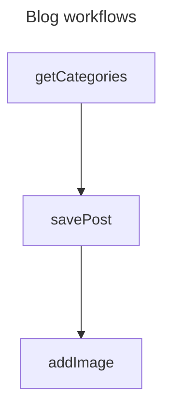

# ApiTapViz

This is a command line tool to produce a human-readable representation of an [OpenAPI Arazzo](https://www.openapis.org/arazzo) file.
Output is available in [Markdown](https://daringfireball.net/projects/markdown/) or [Mermaid](https://mermaid.js.org/) format.

Use this tool to create a representation for summary purposes during development, or to include in your own documentation.

:warning: This tool is at an alpha stage.
Pull requests are welcome, but you'd be an early adopter if you use it now - you have been warned!

Feedback and feature requests are welcome on the main project repo (note: not the GitHub mirror!): <https://codeberg.org/lornajane/apitapviz>

## Installation

This is a Python project, using [uv](https://github.com/astral-sh/uv).

1. Clone the repository to your machine.

2. Run `uv sync`.

3. Run the command with an Arazzo file:

   ```bash
   uv run main.py arazzo.yaml
   ```

## Usage

Command format: `main.py [-h] [--format FORMAT] arazzo.yaml`

* `-h` for the help output.
* `--format` can be `markdown` or `mermaid`.
* Supply a valid OpenAPI Arazzo file in YAML format.

## Example output

Currently the tool supports Mermaid and Markdown format outputs.

### Markdown example

The markdown output lists each step with some supporting data.

```markdown
## Blog workflows

### 1: getCategories

Fetch the category list

- Operation: `$sourceDescriptions.blog.getCategories`
- Outputs: category_id

### 2: savePost

Create the blog post

- Operation: `$sourceDescriptions.blog.createPost`
- Outputs: post_id

### 3: addImage

Upload the image

- Operation: `$sourceDescriptions.blog.uploadFeaturedImage`

```

### Mermaid example

The Mermaid diagram shows summary information for each flow; both the source and result are shown below:

```text
---
title: Blog workflows
---
graph TD
get_categories["getCategories"]
save_post["savePost"]
add_image["addImage"]
get_categories ---> save_post
save_post ---> add_image
```

